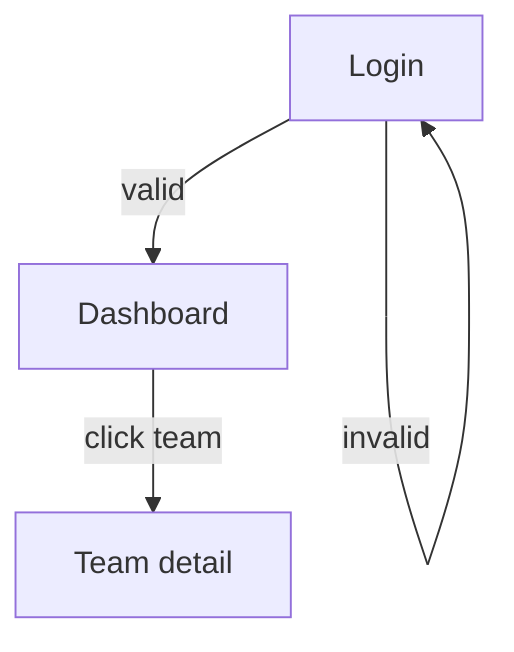

# Phase Deliverables & Approval Gates Protocol

**The principle:** Before agents execute on a phase, the user must approve the **what** (PDD), the **look** (UI mocks), and the **API contract** (OpenAPI spec). These are not optional. Dev Manager cannot break work into tasks until both gates pass.

This protects against expensive rework — implementing the wrong thing, with the wrong UX, against the wrong API, is the most common failure mode of agent-driven development.

## Two Gates per Phase

### Gate 1: PDD + UI Mocks
**Owners:** PM (PDD) + UX (mocks)
**What:** Product Definition Document covering every user flow + visual mock specs for flows that need them
**Approval needed from:** User
**Blocks:** Architect's per-phase OpenAPI work cannot finalize until this gate passes (Architect can draft in parallel for efficiency, but spec sign-off waits for PDD approval)

### Gate 2: OpenAPI Spec
**Owner:** Architect
**What:** Per-phase summary of new/changed endpoints + actual `api/openapi.yaml` updates
**Approval needed from:** User
**Blocks:** Dev Manager cannot break stories into engineering tasks until this gate passes

## Deliverable 1 — Product Definition Document (PDD)

**Owner:** PM
**Filed at:** `docs/wiki/pdd/PDD-PHASE-{N}.md`
**One per phase.** Covers all user flows that ship in that phase.

```yaml
---
title: PDD — Phase N — {Phase Name}
phase: N
status: draft | in-review | approved | superseded
filed: YYYY-MM-DD
owner: pm
deciders: user
tags: [pdd, phase:N]
---
```

Body sections (mandatory):

```markdown
## Phase scope
What's in this phase (link to phases.md for context).

## Personas affected
Which user types use what's being built. Link to personas.md.

## User flows
For each flow:

### Flow N: {Flow Name} — Persona: {persona}

**Trigger:** What initiates the flow.

**Preconditions:** What must be true before the flow starts.

**Happy path (step-by-step):**
1. User does X (sees Y on screen)
2. System does Z (returns W)
3. ...

**Alternative paths:**
- If user does X' instead: ...
- If system returns error E: ...

**Success criteria:** How we know the flow worked.

**Out of scope for this flow (deferred to phase N+1 or backlog):**
- ...

**Cross-references:**
- Wireframe: [ux/mocks/phase-N/flow-name.md]
- API endpoints: (filled by Architect after Gate 2 spec approved)
- Stories: (filled by PM after Gate 2)

## Out of scope for the phase (explicitly)
What this phase does NOT include, even if related.

## Open questions for user
- Anything that needs user input before this PDD can be approved
```

## Deliverable 2 — UI Mocks

**Owner:** UX Designer
**Filed at:** `docs/wiki/ux/mocks/phase-{N}/{flow-name}.md` — one file per flow that needs visual specification
**"Where appropriate":** UX decides per flow. Heuristic — needs a mock if:
- It's a new screen the user will see
- It involves form input, multi-step flow, or complex state
- It changes navigation
- It's a critical persona task

Skip mocks for: pure backend flows, admin one-time setups, automated jobs.

```yaml
---
title: UI Mock — Phase N — {Flow Name}
phase: N
flow: flow-name
status: draft | in-review | approved | superseded
filed: YYYY-MM-DD
owner: ux-designer
deciders: user
tags: [ux, mock, phase:N]
---
```

Body:

```markdown
## Flow / context
Cross-link to PDD flow.

## Layout (per screen)
ASCII wireframe OR Mermaid diagram OR component tree:

```
┌─────────────────────────────────┐
│ [logo] [search]  [user-avatar]  │
├─────────────────────────────────┤
│ Page title                      │
│ ...                             │
└─────────────────────────────────┘
```

## States
- Empty
- Loading
- Error
- Populated

## Interactions
- Click X → triggers Y
- Hover X → reveals Z

## Responsive breakpoints
- Mobile (<768)
- Tablet (768-1024)
- Desktop (>1024)

## Accessibility notes
- Focus order
- ARIA labels
- Color contrast

## Components used
- [Button](../components/button.md)
- ...
```

For multi-screen flows, include a **Mermaid flow diagram**:

```markdown


## Deliverable 3 — OpenAPI Spec Changes (per phase)

**Owner:** Architect
**Filed at:** `docs/wiki/api-changes/phase-{N}.md` (the per-phase summary) + `api/openapi.yaml` (the actual spec)

```yaml
---
title: OpenAPI Changes — Phase N
phase: N
status: draft | in-review | approved | superseded
filed: YYYY-MM-DD
owner: architect
deciders: user
tags: [api, phase:N]
---
```

Body:

```markdown
## Summary
1-2 sentences on what API surface ships in this phase.

## New endpoints (added)
| Method | Path | Auth | Purpose | Schema (link) |
|--------|------|------|---------|---------------|
| POST | /api/v1/tryouts | head_coach | Create tryout | TryoutCreate |

## Modified endpoints
| Method | Path | What changed | Breaking? |
|--------|------|--------------|-----------|
| ... | ... | ... | yes/no |

## New schemas
- TryoutCreate { name, date, location, age_groups[] }
- ...

## Breaking changes (if any)
List with migration notes.

## Cross-references
- PDD flows this serves: PDD-PHASE-N flows 1, 2, 5
- ADRs: ADR-NNN if applicable
- Full spec: [api/openapi.yaml](../../api/openapi.yaml)

## Approval scope
What you're approving when you say "approved":
- The API surface design (endpoints, methods, payload shapes)
- The auth/role gating per endpoint
- The pagination, filtering, sorting conventions used
```

## Approval Workflow (per gate)

### Gate 1 — PDD + UI Mocks

1. PM files PDD with `status: in-review`
2. UX files mocks (one per flow needing visual spec) with `status: in-review`
3. TPM surfaces in dashboard:
   ```
   🔴 GATE 1 — Phase N — Awaiting your approval
   - [PDD-PHASE-N.md](docs/wiki/pdd/PDD-PHASE-N.md)
   - [Mocks: phase-N/](docs/wiki/ux/mocks/phase-N/) (3 mocks)
   ```
4. User reviews. Replies:
   - `PDD-PHASE-N: approved` → PM updates PDD `status: approved`
   - `MOCKS-PHASE-N: approved` → UX updates each mock `status: approved`
   - OR combined: `GATE-1-PHASE-N: approved`
   - Or: `PDD-PHASE-N: needs changes — {description}`
5. When ALL artifacts in gate are approved, TPM marks Gate 1 passed in dashboard

### Gate 2 — OpenAPI Spec

1. Architect updates `api/openapi.yaml` AND files `docs/wiki/api-changes/phase-N.md` with `status: in-review`
2. TPM surfaces in dashboard:
   ```
   🔴 GATE 2 — Phase N — Awaiting your approval
   - [api-changes/phase-N.md](docs/wiki/api-changes/phase-N.md)
   ```
3. User reviews. Replies:
   - `OPENAPI-PHASE-N: approved` → Architect updates `status: approved`
   - Or: `OPENAPI-PHASE-N: needs changes — {description}`
4. When approved, TPM marks Gate 2 passed in dashboard

### After both gates pass

1. PM writes detailed stories per flow (one story per flow, or multiple if a flow is large), informed by approved PDD + mocks + spec
2. Dev Manager breaks each story into engineering tasks
3. Backend + Frontend implement (parallel where dependencies allow)
4. QA tests
5. Phase exit per `pmo/phases.md`

## Concurrent Work Allowed (efficiency)

To avoid pure sequential serialization:
- **UX can draft mocks in parallel with PM drafting PDD** (since they reference each other)
- **Architect can draft API spec in parallel with PDD review** (using draft PDD as input), but cannot file for Gate 2 approval until PDD is approved (otherwise spec is built on shifting ground)
- **PM can begin drafting stories in parallel with Gate 2 review** (using approved PDD), but Dev Manager doesn't pick them up until Gate 2 passes

## Surface to User

The dashboard always shows:
- Open gates (with links to artifacts and reply syntax)
- Time waiting on each gate (so user sees if review is dragging)

## Anti-Patterns

- ❌ Architect designing API spec from a draft (unapproved) PDD and then realizing they have to redo it
- ❌ UX skipping mocks "because the flow is simple" — defer to PM/user; if the user is going to use it, mock it
- ❌ Dev Manager picking up stories before Gate 2 passes
- ❌ "Soft approval" via passing comments — gates close ONLY with explicit approval syntax
- ❌ Per-story PDDs — PDDs are PHASE-level; stories are scoped underneath
- ❌ Re-litigating approved gates mid-implementation — if discovery requires a change, file an addendum or supersede with a new artifact (don't silently mutate)

## What This Replaces

Previously:
- PM wrote stories that conflated requirements + acceptance criteria
- UX wireframed per story (ad-hoc)
- Architect updated OpenAPI continuously without explicit user approval
- Dev Manager could pick up work as soon as a story existed

Now:
- PDDs cover the full phase shape before stories are written
- UI mocks are formalized phase artifacts with explicit user approval
- OpenAPI spec changes per phase are reviewed as a discrete deliverable
- Dev Manager waits for both gates before scoping engineering work
